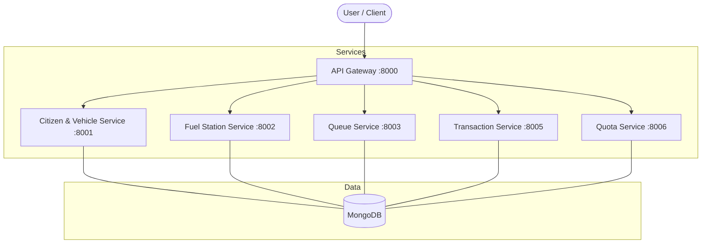

# Fuel Pass System

A professional, microservices-based system designed to manage and streamline fuel distribution. This system provides a robust solution for managing national or regional fuel quotas, citizen and vehicle registrations, and real-time fuel station operations.

## 🚀 Overview

The **Fuel Pass System** is built to handle the complexities of fuel rationing and distribution. It ensures that fuel is distributed fairly among citizens based on vehicle types and weekly quotas, while providing fuel stations with tools to manage their stock and customer queues efficiently.

### ✨ Key Features

- **Automated Quota Management**: Weekly fuel quotas automatically reset, ensuring fair distribution.
- **Microservices Architecture**: Highly scalable and modular design using FastAPI.
- **Unified QR-based Identification**: Vehicles and citizens are linked via a unique system that can be expanded to QR-based verification.
- **Real-time Stock Tracking**: Fuel stations can update and monitor their fuel stock levels in real-time.
- **Queue Management**: Integrated queue service to manage the flow of vehicles at fuel pumps.
- **Transaction History**: Complete audit trail of all fuel purchases and quota deductions.

---

## 🏗️ Architecture

The system follows a modern microservices architecture, with a centralized API Gateway serving as the single entry point for all client requests.



---

## 🔧 Microservices Breakdown

| Service | Responsibility |
| :--- | :--- |
| **API Gateway** | Routing, authentication, and providing unified API documentation. |
| **Citizen & Vehicle** | Manages citizen profiles, vehicle registrations, and linking vehicles to owners. |
| **Fuel Station** | Handles station registrations, fuel stock management, and status updates. |
| **Queue Service** | Manages pump-specific queues and tracks the number of vehicles waiting. |
| **Transaction Service** | Records every fuel purchase and ensures data integrity during transactions. |
| **Quota Service** | Manages weekly fuel limits based on vehicle type and tracks remaining balances. |

---

## 🛠️ Technology Stack

- **Framework**: [FastAPI](https://fastapi.tiangolo.com/) (High-performance Python framework)
- **Database**: [MongoDB](https://www.mongodb.com/) (NoSQL database for flexible data modeling)
- **Communication**: [HTTPX](https://www.python-httpx.org/) (Async HTTP client for inter-service communication)
- **Validation**: [Pydantic](https://docs.pydantic.dev/) (Data validation and settings management)
- **Documentation**: [Swagger UI / OpenAPI](https://swagger.io/) (Automatic interactive API docs)

---

## 🔄 System Workflow

1.  **Registration**: A citizen registers themselves and their vehicle via the **Citizen & Vehicle Service**.
2.  **Stock Arrival**: A fuel station updates their available stock through the **Fuel Station Service**.
3.  **Queue Entry**: When a vehicle arrives at a station, they enter a queue via the **Queue Service**.
4.  **Fuel Purchase**: Upon reaching the pump, the **Transaction Service** checks the **Quota Service** for a valid balance.
5.  **Quota Deduction**: If valid, the fuel is dispensed, the quota is deducted, and the **Transaction Service** records the event.

---

## 📂 Project Structure

```text
Fuel Pass/
├── services/
│   ├── citizen-vehicle-service/  - Manages citizens and their vehicles.
│   ├── quota-service/            - Manages fuel quotas and vehicle type quotas.
│   ├── fuel-station-service/     - Manages fuel stations and stock levels.
│   ├── transaction-service/      - Tracks fuel usage and transactions.
│   └── queue-service/            - Manages fuel pump queues.
├── gateway/                     - API Gateway for routing and authentication.
└── README.md
```

---

## 🏁 Getting Started

### 1. Prerequisites
- **Python 3.12+**: Ensure Python is installed and added to your PATH.
- **MongoDB**: A running MongoDB instance (local or Atlas).

### 2. Setup Virtual Environment
> [!IMPORTANT]
> All setup and activation commands **MUST** be run from the **project root directory** (`Fuel_Pass/`).

1.  **Create the virtual environment**:
    ```powershell
    python -m venv venv
    ```
2.  **Activate the virtual environment**:
    - **Windows (PowerShell)**: `.\venv\Scripts\Activate.ps1`
    - **Windows (CMD)**: `.\venv\Scripts\activate.bat`
3.  **Install all dependencies**:
    ```powershell
    pip install -r services/citizen-vehicle-service/requirements.txt
    pip install -r services/quota-service/requirements.txt
    pip install -r services/fuel-station-service/requirements.txt
    pip install -r services/queue-service/requirements.txt
    pip install -r services/transaction-service/requirements.txt
    pip install -r gateway/requirements.txt
    ```

### 3. Run Services
After activating the virtual environment in your terminal, navigate to the service folder and run it:

| Service | Directory | Command | Port |
| :--- | :--- | :--- | :--- |
| **API Gateway** | `gateway/` | `python main.py` | `8000` |
| **Citizen & Vehicle** | `services/citizen-vehicle-service/` | `python main.py` | `8001` |
| **Fuel Station** | `services/fuel-station-service/` | `python main.py` | `8002` |
| **Queue Service** | `services/queue-service/` | `python main.py` | `8003` |
| **Transaction Service**| `services/transaction-service/` | `python main.py` | `8005` |
| **Quota Service** | `services/quota-service/` | `python main.py` | `8006` |

> [!TIP]
> Each service has its own Swagger documentation at `http://localhost:<PORT>/api-docs`. The unified documentation is available at `http://localhost:8000/api-docs`.

---

## 🛠️ Troubleshooting

### "Fatal error in launcher" or "No Python at..."
If you see errors like `Fatal error in launcher` or `No Python at 'C:\Python312\python.exe'`, your virtual environment is broken (likely due to path changes).

**Fix**: Delete the `venv` folder and recreate it:
1. Delete: `Remove-Item -Recurse -Force venv` (PowerShell) or `rd /s /q venv` (CMD)
2. Re-run the **Setup Virtual Environment** steps above.

### "Term is not recognized"
If you get an error saying `.\venv\Scripts\activate` is not recognized, ensure you are in the **project root** directory (where the `venv` folder is located), not inside a `services/` sub-folder.
